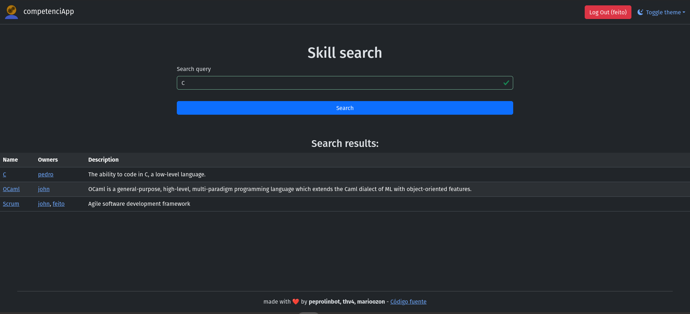

<!--
SPDX-FileCopyrightText: 2025 Mario Denis Radu Trifu <m.denis.radu@udc.es>
SPDX-FileCopyrightText: 2025 Mario Ozón Casais <mario.ozon@udc.es>
SPDX-FileCopyrightText: 2025 Pedro Rey Anca <personal@peprolinbot.com>

SPDX-License-Identifier: GPL-3.0-or-later
-->

# competenciApp


[](https://quay.io/repository/peprolinbot/competenciapp)

This is a [Django](https://www.djangoproject.com/) web app (and PWA) that allows you to register your skills and the resources you used to learn them. So that no one else in your company/organization has to go trough the same struggles you did.

This project takes place at [HackUDC 2025](https://hackudc.gpul.org) and was developed by:

- Pedro Rey Anca
- Mario Denis Radu Trifu
- Mario Ozón Casais

## 📝 License

This project is licensed under [GPLv3](https://www.gnu.org/licenses/gpl-3.0.html).

## 🖼️ Logo Usage

The logo used is in this project is free to use.

## ✨ Features
- Multi**use**r 👥, all your company can **use** it (pun intended)
- Supports SSO using [allauth](https://allauth.org)
- Responsive, and we also have a PWA!!! 📱📱
- Totally Dockerized🐋 in one small, optimized, alpine-based image
- Uses tha amazing [Django framework](https://www.djangoproject.com/) 🐍🐍

## 📷 Screenshots





## 🔧 Installation

### 🐳 Docker (Recommended)

If you want to host your own instance of the web, it is as easy as a docker container. Check the environment variables below to configure important things, as this example below supposes things like the mail server doesn't use authentication, which isn't realistic.

So the command is:

```bash
docker run -d --name competenciapp \
    -e DJANGO_ALLOWED_HOSTS="example.com" \
    -e DJANGO_SECRET_KEY="changemetosomethingsecureplease" \
    -e EMAIL_HOST="127.0.0.1" \
    -e DEFAULT_FROM_EMAIL="competenciapp@example.com" \
    -e EMAIL_BASE_URL="http://example.com" \
    -p 8080:80 \
    -v /data/competenciapp-cfg/db.sqlite3:/app/db.sqlite3 \
    quay.io/peprolinbot/competenciapp:latest
```

### ⚙️ Environment Variables

| Name                     | Description |
|--------------------------|-------------|
| `DJANGO_DEBUG` (bool)    | Whether to enable Django's debug mode. Leave it false in production. _(Default: False)_ |
| `DJANGO_ALLOWED_HOSTS` | Space-separated list of host/domain names that Django can serve. Not needed in debug mode (**otherwise is needed**). _(Default: "")_ |
| `DJANGO_SECRET_KEY`  |  The key to securing signed data. Must be randomly generated and kept secure. _(Default: "django-insecure-xplh11sh6)6qg(u^vdbh=*kp=hae*#r-o%p!ik0$e8y0)vsq+w")_ |
| `DJANGO_CSRF_TRUSTED_ORIGINS` | Space-separated list of trusted origins for unsafe requests. Not needed in debug mode, and when running on port 80/443. _(Default: "")_ |
| `DJANGO_SOCIALACCOUNT_PROVIDERS_FILE` | You can check more information [here](https://docs.allauth.org/en/dev/socialaccount/provider_configuration.html) _(Default: "/tmp/social_account_providers.json")_ |
| `DJANGO_TIME_ZONE`  |  You can check more information [here](https://docs.djangoproject.com/en/5.1/ref/settings/#:~:text=TIME_ZONE) _(Default: "Europe/Madrid")_ |
| `EMAIL_HOST`  |  Smtp server host  _(Default: "localhost")_
| `EMAIL_USE_TLS`  |  _(Default: False)_
| `EMAIL_USE_SSL`  |  _(Default: False)_
| `EMAIL_PORT`  |  _(Default: 25)_
| `EMAIL_HOST_USER`  |   _(Default: "")_
| `EMAIL_HOST_PASSWORD`  |   _(Default: "")_
| `DEFAULT_FROM_EMAIL`  |  Email address used when sending  _(Default: "webmaster@localhost")_
| `EMAIL_BASE_URL`  |  Used for the images and urls in the emails  _(Default: "http://127.0.0.1:8000")_


_**Note🗒️:**_ Booleans are only true when their value is the string "true" (not case sensitive)

_**Note🗒️:**_ EMAIL_USE_TLS/EMAIL_USE_SSL are mutually exclusive, so only set one of those settings to True.

_**Tip💡:**_ You can generate a secret key with `openssl rand -hex 32`

_**Tip💡:**_ You can check [Django's documentation](https://docs.djangoproject.com/en/5.1/) to better understand these variables

### Building the Docker image

```bash
git clone https://github.com/peprolinbot/competenciApp-hackudc25.git
cd competenciApp-hackudc25
docker build -t competenciapp .
```

### 💪🏻 Without Docker (for development)

Only use this for development unless you know what you're doing.

```bash
git clone https://github.com/peprolinbot/competenciApp-hackudc25.git
cd competenciApp-hackudc25
export DJANGO_DEBUG=true
python3 manage.py runserver
```

Please check [Django's documentation](https://docs.djangoproject.com/en/5.1).
